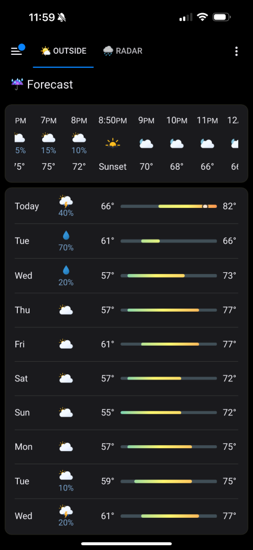

# iOS Weather Card

Credits go to [basmilius](https://github.com/basmilius) for the awesome [weather icons](https://github.com/basmilius/weather-icons) and of course [pkissling](https://github.com/pkissling) for the orignal code.


[^1]

## Installation

### Manual Installation

1. Download the [clock-weather-card](https://www.github.com/FutureGUIs/ios-weather-card/releases/latest/download/clock-weather-card.js).
2. Place the file in your Home Assistant's `config/www` folder.
3. Add the configuration to your `ui-lovelace.yaml`.

   ```yaml
   resources:
     - url: /local/clock-weather-card.js
       type: module
   ```

4. Add [configuration](#configuration) for the card in your `ui-lovelace.yaml`.

### Installation and tracking with `hacs`

1. Make sure the [HACS](https://github.com/custom-components/hacs) component is installed and working.
2. Search for `clock-weather-card` in HACS and install it.
3. Depening on whether you manage your Lovelace resources via YAML (3i) or UI (3ii), you have to add the corresponding resources.
   1. **YAML:** Add the configuration to your `ui-lovelace.yaml`.

      ```yaml
      resources:
        - url: /hacsfiles/clock-weather-card/clock-weather-card.js
          type: module
      ```

   2. **UI:** Add Lovelace resource [](https://my.home-assistant.io/redirect/lovelace_resources).
      *(Alternatively go to Settings -> Dashboards -> Resources -> Add Resource)*

      ```yaml
      URL: /hacsfiles/clock-weather-card/clock-weather-card.js
      Type: JavaScript Module
      ```

4. Restart Home Assistant.
5. Add [configuration](#configuration) for the card in your `ui-lovelace.yaml` or via the UI.

## Configuration

### Minimal configuration

```yaml
type: custom:clock-weather-card
entity: weather.home
```

### Full configuration

```yaml
type: custom:clock-weather-card
entity: weather.home
title: Home
sun_entity: sun.sun
temperature_sensor: sensor.outdoor_temp
weather_icon_type: line
animated_icon: true
forecast_rows: 5
locale: en-GB
time_pattern: HH:mm
time_format: 24
date_pattern: P
hide_today_section: false
hide_forecast_section: false
hide_clock: false
hide_date: false
hourly_forecast: false
use_browser_time: false
time_zone: null
```

### Options

| Name                  | Type             | Requirement  | Description                                                                                                                                                                                                                       | Default   |
| --------------------- | ---------------- | ------------ | --------------------------------------------------------------------------------------------------------------------------------------------------------------------------------------------------------------------------------- | --------- |
| type                  | string           | **Required** | `custom:clock-weather-card`                                                                                                                                                                                                       |           |
| entity                | string           | **Required** | ID of the weather entity                                                                                                                                                                                                          |           |
| title                 | string           | **Optional** | Title of the card                                                                                                                                                                                                                 | `''`      |
| sun_entity            | boolean          | **Optional** | ID of the sun entity. Used to determine whether to show a day or night icon. If sun integration is not enabled, day icon will be shown                                                                                            | `sun.sun` |
| temperature_sensor    | string           | **Optional** | ID of the temperature sensor entity. Used to show the current temperature based on a sensor value instead of the weather forecast                                                                                                 | `''`      |
| weather_icon_type     | `line` \| `fill` | **Optional** | Appearance of the large weather icon                                                                                                                                                                                              | `line`    |
| animated_icon         | boolean          | **Optional** | Whether the large weather icon should be animated                                                                                                                                                                                 | `true`    |
| forecast_rows         | number           | **Optional** | The amount of weather forecast rows to show. Depending on `hourly_forecast` each row either corresponds to a day or an hour                                                                                                       | `5`       |
| locale                | string[^2]       | **Optional** | Language to use for language specific text and date/time formatting. If not provided, falls back to the locale set in HA or, if not set in HA, to `en-GB`                                                                         | `en-GB`   |
| time_format           | `24` \| `12`     | **Optional** | Format used to display the time. If not provided, falls back to the default time format of the configured `locale`.  This option is ignored if `time_pattern` is set.                                                             | `24`      |
| time_pattern          | string           | **Optional** | Pattern to use for time formatting. See [luxon](https://moment.github.io/luxon/#/formatting?id=table-of-tokens) for valid tokens. If not provided, falls back to time_format option.                                              | `null`    |
| date_pattern          | string           | **Optional** | Pattern to use for date formatting. If not provided, falls back to a localized default date formatting. See [luxon](https://moment.github.io/luxon/#/formatting?id=table-of-tokens) for valid tokens                              | `D`       |
| hide_today_section    | boolean          | **Optional** | Hides the cards today section (upper section), containing the large weather icon, clock and current date                                                                                                                          | `false`   |
| hide_forecast_section | boolean          | **Optional** | Hides the cards forecast section (lower section),containing the weather forecast                                                                                                                                                  | `false`   |
| hide_clock            | boolean          | **Optional** | Hides the clock from the today section and prominently displays the current temperature instead                                                                                                                                   | `false`   |
| hide_date             | boolean          | **Optional** | Hides the date from the today section                                                                                                                                                                                             | `false`   |
| hourly_forecast       | boolean          | **Optional** | Displays an hourly forecast instead of daily                                                                                                                                                                                      | `false`   |
| use_browser_time      | boolean          | **Optional** | Uses the time from your browser to indicate the current time. If not provided, uses the [time_zone](https://www.home-assistant.io/blog/2015/05/09/utc-time-zone-awareness/#setting-up-your-time-zone) configured in HA            | `false`   |
| time_zone             | string           | **Optional** | Uses the given [time zone](https://en.wikipedia.org/wiki/List_of_tz_database_time_zones) to indicate the current date and time. If not provided, uses the time zone configured in HA                                              | `null`    |

## Footnotes

[^1]: Theme used: [lovelace-ios-themes](https://github.com/basnijholt/lovelace-ios-themes).
[^2]: Supported languages: `bg`, `ca`, `cs` `da`, `de`, `el`,`en`, `es`, `et`, `fi`, `fr`, `he`, `hu`, `it`, `ko`, `nb`, `nl`, `pl`, `pt`, `pt-BR`, `ro`, `ru`, `sk`, `sl`, `sv`, `th`, `uk`, `vi`, `zh-CN`, `zh-TW`
